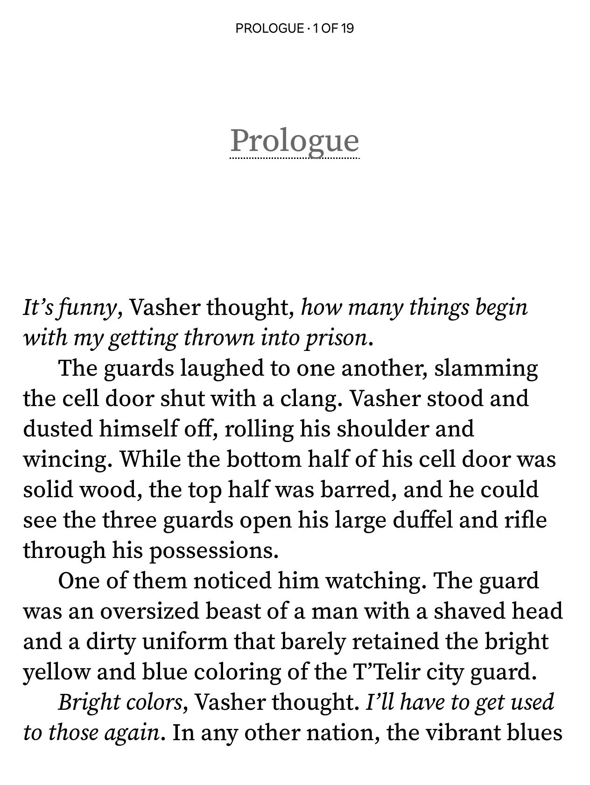

# Sourcerer

**Sourcerer** is a modified font based on [Source Serif 4](https://github.com/adobe-fonts/source-serif), optimized for e-readers.

<kbd></kbd>

The original Source Serif 4 variable font is located in `src` and is available under the same OFL as the end result, which is included in `LICENSE`.

## Downloads

Two versions are generated via the pipeline of the [latest release](../../releases/latest):

- **KF_Sourcerer.zip** — Kobo-optimized TrueType fonts with a legacy kern table and `KF` prefix. Use this if you have a Kobo e-reader, this version contains optimizations made with [Kobo Font Fix](https://github.com/nicoverbruggen/kobo-font-fix).
- **Sourcerer.zip** — The standard, unmodified fonts, as TrueType files. Useful for other e-readers and use on your desktop computer or smartphone.

## Project structure

- `src`: Source Serif 4 variable font TTFs
- `build.py`: The build script to generate Sourcerer
- `LICENSE`: The OFL license
- `COPYRIGHT`: Copyright information, later embedded in font
- `VERSION`: The version number, later embedded in font

After running `build.py`, you should get:

- `out/ttf`: final TTF fonts (generated)

## Prerequisites

- **Python 3**
- **[fontTools](https://github.com/fonttools/fonttools)** — install with `pip install fonttools`
- **[FontForge](https://fontforge.org)** — the build script auto-detects FontForge from PATH, Flatpak, or the macOS app bundle
- **[ttfautohint](https://freetype.org/ttfautohint/)** — required for proper rendering on Kobo e-readers

### Linux preparation

```
sudo apt install ttfautohint        # Debian/Ubuntu
sudo dnf install ttfautohint        # Fedora
brew install ttfautohint            # Bazzite (immutable Fedora)
pip install fonttools
flatpak install flathub org.fontforge.FontForge
```

### macOS preparation

#### System Python

On macOS, if you're using the built-in version of Python (via Xcode), you may need to first add a folder to your `PATH` to make `font-line` available, like:

```bash
echo 'export PATH="$HOME/Library/Python/3.9/bin:$PATH"' >> ~/.zshrc
brew install fontforge ttfautohint
brew unlink python3 # ensure that python3 isn't linked via Homebrew
pip3 install fonttools
source ~/.zshrc
```

#### Homebrew Python

If you're using `brew install python`, pip requires a virtual environment:

```bash
brew install fontforge ttfautohint
python3 -m venv .venv
source .venv/bin/activate
pip install fonttools
```

## Building

**Note**: If you're using `venv`, you will need to activate it first:

```
source .venv/bin/activate
```

If you are just using the system Python, you can skip that step and simply run:

```
python3 build.py
```

To customize the font family name or disable outline fixes:

```
python3 build.py --customize
```

The build script (`build.py`) uses `fontTools` and FontForge to transform the Source Serif 4 variable fonts into Sourcerer. After export, it post-processes the TTFs: normalizing style flags and modifying the lowercase `e` glyph. Configuration and step-by-step details live in the header comments of `build.py`.
